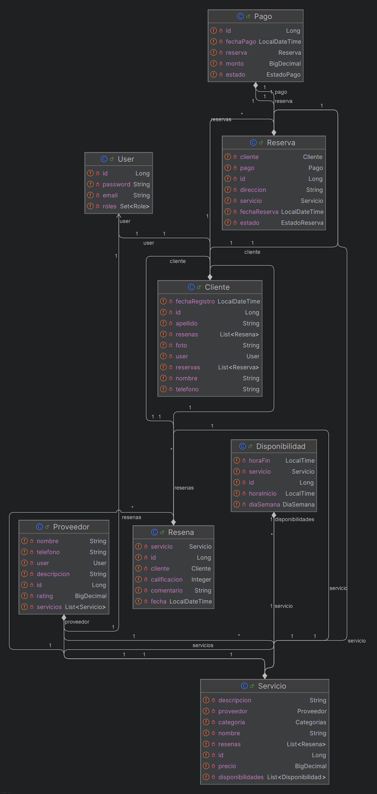

# 🧹 Marketplace de Servicios Domésticos
## CS 2031 – Desarrollo Basado en Plataforma  
### Integrantes del equipo
- **Rafael Oliverth Solier Soto**  
- **Yulinio Zavala Mariño**  
---
## Índice
1. [Introducción](#introducción)
2. [Identificación del Problema o Necesidad](#identificación-del-problema-o-necesidad)
3. [Descripción de la Solución](#descripción-de-la-solución)  
   3.1. [Funcionalidades Implementadas](#funcionalidades-implementadas)  
   3.2. [Tecnologías Utilizadas](#tecnologías-utilizadas)
4. [Modelo de Entidades](#modelo-de-entidades)
5. [Testing y Manejo de Errores](#testing-y-manejo-de-errores)
6. [Medidas de Seguridad Implementadas](#medidas-de-seguridad-implementadas)
7. [Eventos y Asincronía](#eventos-y-asincronía)
8. [Uso de GitHub](#uso-de-github)
9. [Conclusión](#conclusión)
10. [Apéndices](#apéndices)
## 📝 Descripción General
---

## Introducción

**Contexto: ✏️**  
En las zonas urbanas de Perú, encontrar rápidamente profesionales confiables para tareas domésticas —desde una simple limpieza profunda hasta reparaciones eléctricas de urgencia— continúa siendo un dolor de cabeza. La oferta de servicios suele estar dispersa en redes sociales, anuncios impresos o recomendaciones informales, lo que dificulta comparar precios, disponibilidad y reputación. Además, la informalidad del sector limita la transparencia y la seguridad tanto para clientes como para proveedores.

**Objetivos del proyecto: 🎯**
- Facilitar el **registro y acceso seguro** de clientes y proveedores.
- Ofrecer a los proveedores una **vitrina digital** para publicar y administrar sus servicios domésticos.
- Permitir a los clientes **descubrir, reservar y pagar** dichos servicios de forma sencilla.
- Fomentar la **confianza** mediante un sistema transparente de reseñas y calificaciones tras cada servicio.

---
## Identificación del Problema o Necesidad

**Descripción del problema: 🤔**  
La informalidad y falta de estandarización en el mercado de servicios domésticos provoca frustración en los hogares: citaciones que nunca llegan, trabajos de mala calidad y sobrecostos de último minuto. Simultáneamente, miles de técnicos y especialistas capacitados carecen de un canal digital que les permita visibilizar su trabajo y escalar su negocio de manera formal.

**Justificación: ✅**  
Resolver esta brecha es clave para mejorar la calidad de vida en los hogares urbanos y formalizar la economía de los trabajadores del sector. Al conectar clientes y proveedores en un entorno regulado, con procesos de verificación y reputación, el proyecto reduce asimetrías de información, fomenta el empleo formal y contribuye a la profesionalización del servicio doméstico en el país.

---
## Descripción de la Solución
La aplicación seguirá arquitectura hexagonal:
```text 
Controller → Service → Entities → Database
        ↕          ↕       ↕
     DTO/Mapper    Repository
```
### Funcionalidades Implementadas

* Registro y autenticación de **clientes** y **proveedores** mediante JWT.
* Gestión de perfiles de proveedores: creación, actualización y eliminación de servicios.
* Búsqueda de servicios con filtros opcionales (categoría, descripción, rango de precio, calificación, paginación).
* Gestión completa de **reservas** (PENDIENTE, ACEPTADA, COMPLETADA, CANCELADA).
* Procesamiento de **pagos** asociados a reservas.
* Sistema de **reseñas**: creación y listado de reseñas por servicio.
* Notificaciones por correo electrónico en eventos clave (registro, nueva reserva, aceptación, cancelación, pago, completado) con plantillas Thymeleaf.
* API REST documentada y probada con **Postman** (`postman_collection_v1.json`).
* Pruebas unitarias e integración con **JUnit 5**, **Mockito** y **Testcontainers**.


### Tecnologías Utilizadas
- **Java 17 + Spring Boot 3.3** → núcleo del backend y arranque rápido.
- **Spring Starters** (Web, Data JPA, Security, Validation, AOP) → HTTP, persistencia, seguridad y validación listos “out-of-the-box”.
- **PostgreSQL 15** (producción) + **HikariCP** → base de datos robusta con *pool* de conexiones veloz.
- **H2 en memoria** + **Testcontainers** → pruebas locales e integración sin depender de una DB externa.
- **JWT** + **BCrypt 12** → autenticación *stateless* y contraseñas seguras.
- **Lombok** → elimina getters/setters y reduce código repetitivo.
- **Maven** → compila, prueba y empaqueta con un solo comando.
- **JUnit 5 + Spring Boot Test + Mockito** → pruebas unitarias e integración automatizadas.
- **GitHub Actions** → ejecuta build, tests y crea la imagen Docker en cada *push*.
- **Docker 20.10** → despliegue idéntico en cualquier servidor.
---
## Modelo de Entidades

La capa de dominio incluye las siguientes entidades principales:

* **User** (base): `id`, `nombre`, `email`, `password`, `roles`.
* **Cliente** (extiende User): lista de reservas.
* **Proveedor** (extiende User): lista de servicios.
* **Servicio**: `id`, `titulo`, `descripcion`, `categoria`, `tarifa`, `calificacionPromedio`; relación ManyToOne con Proveedor y OneToMany con Disponibilidad.
* **Disponibilidad**: `id`, `fecha`, `horaInicio`, `horaFin`; ManyToOne con Servicio.
* **Reserva**: `id`, `fechaReserva`, `estado` (PENDIENTE, ACEPTADA, COMPLETADA, CANCELADA); ManyToOne con Cliente y con Disponibilidad.
* **Pago**: `id`, `monto`, `fechaPago`, `estado`; ManyToOne con Reserva.
* **Reseña**: `id`, `calificacion`, `comentario`, `fecha`; ManyToOne con Cliente y Servicio.

## Testing y Manejo de Errores
#### Colección de Postman
Se incluye un una colección de Postman con todos los endpoints implementados. (Se debe configurar localhost como base y agregar a variable global)
#### Pirámide de testing

| Capa | Clases de prueba | Framework | Propósito |
|------|-----------------|-----------|-----------|
| **Unitarias – Dominio** | 8 | JUnit 5 | Valida reglas de entidades (`equals`, `hashCode`, restricciones de negocio). |
| **Integración – Controladores** | 6 | `@SpringBootTest` + **MockMvc** | Ejecuta endpoints REST con contexto Spring completo y base H2 embebida. |
| **Integración – Repositorios** | 3 | `@SpringBootTest` + **Testcontainers** | Verifica consultas JPA sobre un PostgreSQL 15 efímero. |
| **Smoke** | 1 | `@SpringBootTest` | Comprueba que el contexto de la aplicación levanta correctamente. |

> **Totales:** 18 clases de prueba ≈ 270 aserciones ·
#### Manejo de errores
El paquete `exception` centraliza y normaliza todas las fallas de la aplicación.

```java
@RestControllerAdvice
public class GlobalExceptionHandler {

  @ExceptionHandler(MethodArgumentNotValidException.class)
  public ResponseEntity<ApiError> handleValidationErrors() { }

  @ExceptionHandler(ResourceNotFoundException.class)
  public ResponseEntity<ApiError> handleNotFound() { }

  // Otros mapeos: ConflictException, JwtException, etc.
}
```

| Escenario      | Componente Spring               | HTTP | Payload de Respuesta                          |
|---------------|---------------------------------|------|-----------------------------------------------|
| **Validación DTO** | `MethodArgumentNotValidException` | 400  | `{ timestamp, status, errors[{field, message}], path }` |
| **Recurso inexistente** | `ResourceNotFoundException`     | 404  | `{ timestamp, status, error, message, path }` |
| **Conflicto de negocio** | `ConflictException`             | 409  | `{ timestamp, status, error, message, path }` |
| **Token ausente/expirado** | `RestAuthenticationEntryPoint`  | 401  | `{ timestamp, status, error: "Unauthorized", message, path }` |
| **Permiso insuficiente** | `RestAccessDeniedHandler`       | 403  | `{ timestamp, status, error: "Forbidden", message, path }` |
| **Errores JWT** | `JwtException`                  | 401  | `Motivo del fallo (firma, expiración, etc.)`  |
| **Internal Server Error**          | `Exception`                     | 500  | `Error inesperado`                                           |
    

## Medidas de Seguridad Implementadas
La seguridad en las aplicaciones es fundamental para proteger los datos sensibles, garantizar la integridad del sistema y prevenir accesos no autorizados. Las siguientes medidas han sido implementadas para ofrecer una arquitectura robusta y alineada con buenas prácticas de desarrollo seguro.
| **Capa**            | **Medida**               | **Detalle**                                                                 |
|---------------------|---------------------------|------------------------------------------------------------------------------|
| **Autenticación**   | JWT                       | Tokens HS512, exp. 60 min; endpoint de _refresh_.                           |
| **Almacenamiento**  | BCrypt 12                 | _Hash_ y _salt_ de contraseñas.                                             |
| **Autorización**    | Spring Method Security    | `@PreAuthorize` para proteger recursos.                                     |
| **Datos en tránsito** | HTTPS                   | Configurado en proxy Nginx.                                                 |
| **Validación**      | Bean Validation           | `@NotBlank`, `@Email`,`@Valid`,`@Size`,`@Min`,`@Max`; respuestas 400 uniformes.                            |
| **Prevención**      | JPQL parametrizado, CORS  | CORS restrictivo, filtro XSS básico.                                        |

## Eventos y Asincronía
En **Marketplace**, los eventos y la asincronía juegan un papel importante para mejorar la eficiencia del sistema, especialmente en tareas que no requieren una respuesta inmediata. El envío de correos electrónicos es uno de los principales ejemplos de este enfoque. En lugar de procesar estas tareas de manera síncrona, lo cual podría generar demoras innecesarias para el usuario, se ejecutan en segundo plano, permitiendo que la experiencia sea más fluida.
#### Casos de uso del envío de correos electrónicos:
1. Registro de un nuevo Cliente/proveedor:
- Cuando un nuevo usuario se registra en la plataforma, se dispara un evento que envía de forma asíncrona un correo electrónico de bienvenida. Este correo confirma el registro del Cliente/Proveedor y proporciona información útil para comenzar a interactuar en la plataforma. El envío de este correo en segundo plano permite que el usuario complete el proceso de registro sin esperas innecesarias.
2. Solicitud de una reserva:
- Cuando un cliente solicita una reserva de algún servicio de un proveedor, se diapra un evento asíncrono que envía un correo electrónico a este último donde se le infroma que alguien requiere de uno de sus servicios y debe ingresar a la plataforma para aceptar/rechazar la solicitud.
3. Rechazo de una solicitud:
- Cuando un proveedor rechaza la solicitud de un cliente, se dispara un evento asíncrono que envía un correo a este último donde se informa que no se pudo hacer su reserva.
4. Confirmación de pago:
- Cuando se confirma el pago de una reserva, se dispara un evento asíncrono que envía un correo electrónico tanto al cliente como al proveedor. Este correo informa que el pago fue exitoso y que la reserva ya está asegurada. Al realizarse el envío en segundo plano, se garantiza una experiencia fluida sin interrupciones para el usuario.

5. Aceptación de una reserva:
- Cuando un proveedor acepta una solicitud de reserva, se dispara un evento que envía asíncronamente un correo al cliente. En este correo se confirma que su solicitud fue aceptada y se detallan los próximos pasos. Esto permite mantener informado al cliente sin afectar el rendimiento de la plataforma.

6. Reserva completada:
- Al finalizar un servicio reservado, se dispara un evento asíncrono que envía un correo electrónico al cliente para notificar que la reserva ha sido completada con éxito. Este mensaje puede incluir opciones de valoración del servicio o recomendaciones relacionadas.

7. Reserva cancelada:
- Cuando un cliente decide cancelar una reserva, se dispara un evento que envía de manera asíncrona un correo al proveedor. Este correo le informa que la reserva ha sido cancelada, lo que le permite tomar las medidas necesarias, como liberar el horario o reagendar.

8. Pago de la reserva:
- Cuando se realiza el pago inicial de una reserva, se dispara un evento asíncrono que envía un correo tanto al cliente como al proveedor. El mensaje confirma que el pago ha sido recibido y que la reserva está en proceso. Esto permite a ambas partes estar al tanto sin afectar la experiencia de uso en la plataforma.

## Uso de GitHub
El desarrollo de **Marketplace** se gestionó de forma colaborativa utilizando **GitHub**, empleando un flujo de trabajo basado en ramas, issues y pull requests para organizar y revisar el trabajo de todo el equipo.

#### 🗂️Ramas (Branches)
Cada nueva funcionalidad o corrección de errores se desarrolló en **ramas independientes** para evitar conflictos con la rama principal (`main`). Esto permitió que los miembros del equipo trabajaran en paralelo de manera eficiente y ordenada.

#### 📌 Issues
Se utilizaron **issues** para:

- Asignar tareas
- Reportar errores
- Gestionar el progreso del proyecto
#### 🔄 Pull Requests
Antes de fusionar cualquier cambio en la rama principal, se creaba un **pull request (PR)**.  Esto permitió que los cambios fueran revisados y discutidos por el equipo, asegurando la **calidad del código** antes de su integración.

#### ✅ Beneficios del Flujo de Trabajo

Este flujo de trabajo colaborativo permitió:

- Mantener el proyecto **organizado**
- Mejorar la calidad del código mediante **revisiones**
- Asegurar una **integración continua sin problemas**
---
## Conclusión
### Logros del Proyecto: 📝
El desarrollo de **Marketplace de Servicios Domésticos** ha materializado una plataforma que conecta de forma segura y transparente a hogares con técnicos y especialistas confiables. Se integraron módulos completos de autenticación JWT, catálogo y reserva de servicios, pagos simulados y un sistema de reputación que reduce la informalidad del sector. Gracias a ello, los clientes pueden contratar mano de obra calificada con unos pocos clics, mientras que los proveedores obtienen visibilidad y un canal formal de ingresos. El despliegue automatizado vía GitHub Actions y Docker garantiza que la aplicación sea repetible y fácil de escalar.

### Aprendizajes Clave: 📚
- **Diseño Hexagonal:** Separar dominio, infraestructura y puertos REST nos facilitó las pruebas y dio flexibilidad para cambios futuros.
- **Seguridad End-to-End:** Implementar Spring Security con JWT y BCrypt nos enseñó buenas prácticas de cifrado y manejo de sesiones _stateless_.
- **CI/CD en la nube:** Automatizar compilación, pruebas y empaquetado Docker en cada _push_ nos demostró la importancia de la entrega continua para mantener la calidad.
- **Trabajo Colaborativo en GitHub Projects:** La gestión de issues y _pull requests_ con revisiones cruzadas fomentó feedback constante y detección temprana de bugs.

### Trabajo Futuro: 🚀
- **Pagos en tiempo real:** Integrar una pasarela como Culqi o Mercado Pago para transacciones reales.
- **Geolocalización y horarios en vivo:** Mostrar proveedores cercanos y disponibilidad en tiempo real mediante sockets.
- **Chat cliente-proveedor:** Habilitar mensajería directa y envío de fotos antes de la visita.
- **Facturación electrónica SUNAT:** Generar comprobantes válidos para proveedores formalizados.
- **Monetización y fidelización:** Implementar planes premium para proveedores y un sistema de puntos o descuentos para clientes recurrentes.
---
## Apéndices
### Licencia
**Marketplace de Servicios Domésticos** está bajo la licencia MIT.
### Referencias

- Documentación de Node.js: <https://nodejs.org/>
- Documentación de PostgreSQL: <https://www.postgresql.org/docs/>
- Spring Boot Reference, apuntes del curso

